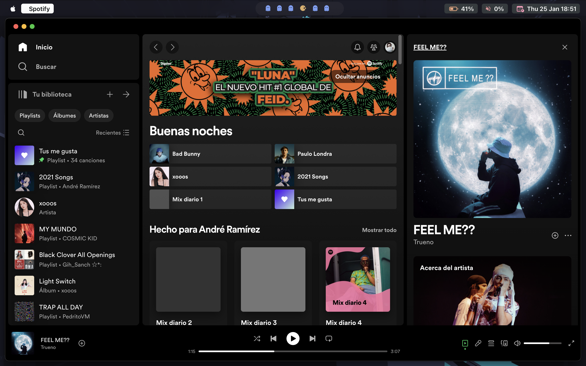
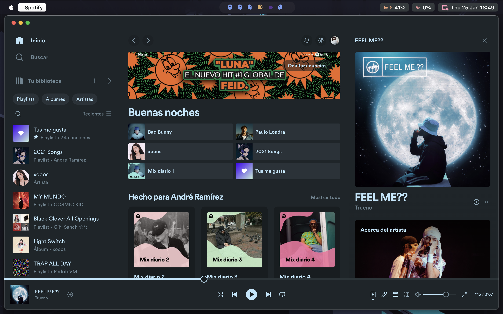
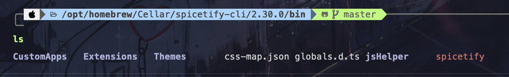
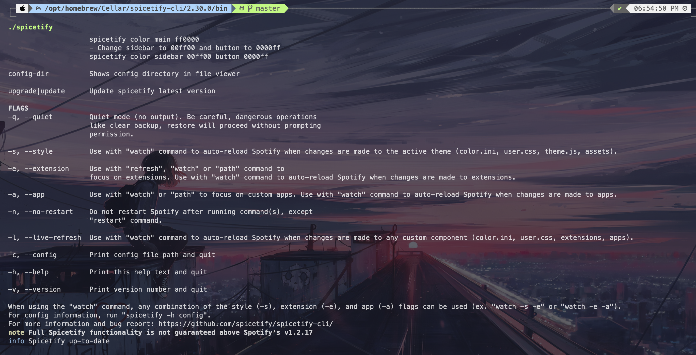
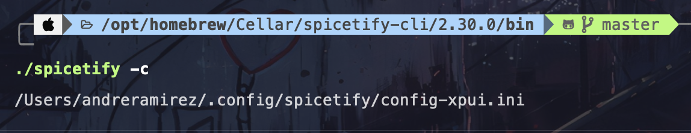
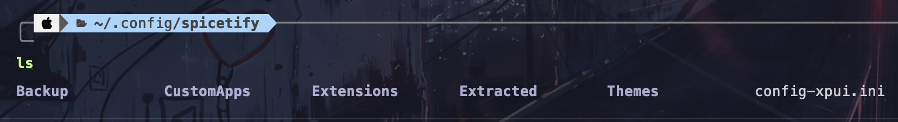
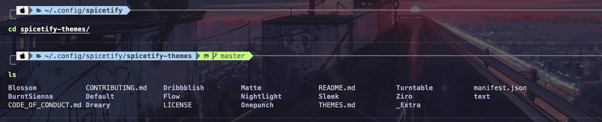
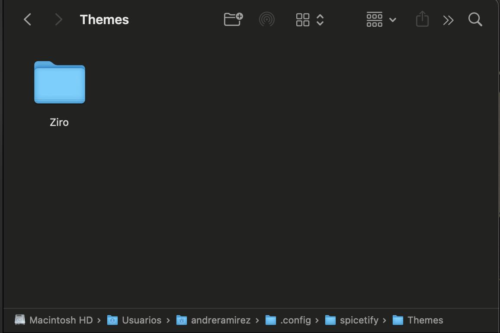
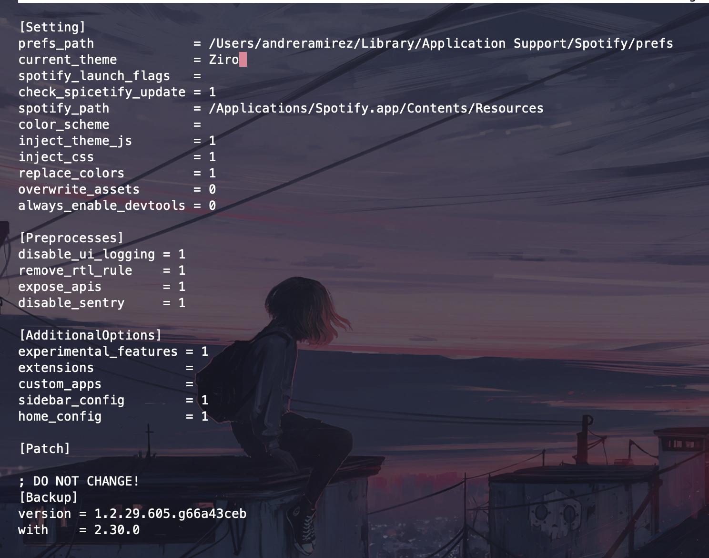
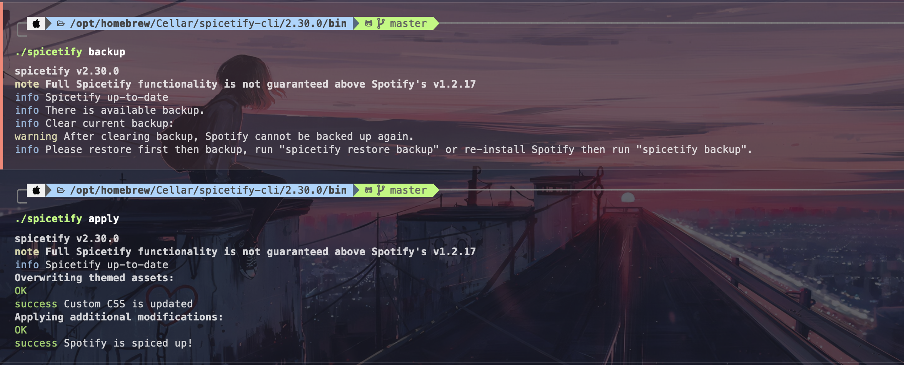

# Change Spotify Theme in MacOS

## Using `spicetify`

## Before



## Theme



## English

---

### Using Homebrew to install spicetify

```
brew install spicetify/homebrew-tap/spicetify-cli
```

### Check the path

```
cd /opt/homebrew/Cellar/spicetify-cli/2.30.0/bin/
```

### In terminal use `ls` to see the content



### Now use:

```
./spicetify
```



### Check the path with

```
./spicetify -c
```



### Go to the path and check the content



### Ready for themes

## Themes Installation

### In the same path clone this repo with the themes

```
git clone https://github.com/spicetify/spicetify-themes.git
```

### Check de content



### Copy any folder theme (in this case I choose Ziro) `Ziro` to folder `Themes`



### Choose the theme to use and edit `config-xpui.init`

### Using nano or any app to edit `current_theme` and write folder name of theme



### Save and exec in the path `/opt/homebrew/Cellar/spicetify-cli/2.30.0/bin/`

```
./spicetify backup
```

```
./spicetify apply
```



### When Spotify is open reboot or open the app to see the theme

---

## Español

### Para hacer el cambio se hace uso de HomeBrew, con el siguiente comando:

```
brew install spicetify/homebrew-tap/spicetify-cli
```

### Siguiendo ahora debemos revisar la ruta para saber que se ha instalado correctamente

```
cd /opt/homebrew/Cellar/spicetify-cli/2.30.0/bin/
```

### En la terminal podemos hacer un ls para ver que archivos existen


### Hacemos lo siguiente:

```
./spicetify
```


### Verificamos el path de la configuración con el siguiente comando

```
./spicetify -c
```


### Vamos a ese path y verificamos su contenido


### Con esto comprobamos que ya está listo para los temas

## Instalación de Temas

### En el mismo path dónde nos quedamos antes hacemos este clone que contiene varios temas

```
git clone https://github.com/spicetify/spicetify-themes.git
```

### Revisamos el contenido clonado


### Pasamos una carpeta, en este caso usaré la llamada `Ziro` a la carpeta `Themes`


### Ahora para indicar que este tema es el que queremos usar, nos vamos al archivo `config-xpui.ini`

### Haciendo uso de nano o un editor de texto, editamos la parte siguiente `current_theme` y ponemos el nombre de la carpeta que pasamos


### Luego guardamos y ejecutamos los siguientes comandos en el path `/opt/homebrew/Cellar/spicetify-cli/2.30.0/bin/`

```
./spicetify backup
```

```
./spicetify apply
```


### Si tenemos el Spotify abierto se reiniciará o sino unicamente lo debemos abrir y debería estar aplicado el tema.
